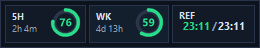
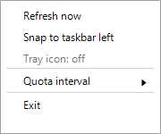

<div align="center">
  
  <h1>Codex 用量监控</h1>
  <p><strong>Python/Tk 版</strong> · Windows 桌面版 Codex 的任务栏常驻用量监控组件</p>
</div>

这是一个个人自用的 Windows 任务栏悬浮监控组件，用来显示 Codex 的 5 小时额度、一周额度和额度读数刷新状态。界面常驻置顶，默认贴靠在任务栏左侧。

本项目服务于 Windows 系统上的桌面版 Codex 使用场景，用于在本机桌面环境中观察当前 Codex 额度。它不是面向 Codex CLI 的通用命令行工具、封装器或替代入口；虽然内部会调用本机 `codex.exe` 的 app-server 接口，但用户侧定位是桌面常驻监控组件。

本项目由 OpenAI Codex 协助开发。本项目不是 OpenAI 官方项目。项目主要为个人自用，除严重或破坏性 bug 外，不承诺后续维护、兼容性支持或功能请求响应。仓库未提供开源许可证；公开可见不等于主动授予复用权利。

## 功能

- `5H`：Codex 返回的短周期额度窗口。本组件显示该窗口的剩余额度百分比，并在下方显示距离重置的大致时间。
- `WK`：Codex 返回的一周额度窗口。本组件显示该窗口的剩余额度百分比，并在下方显示距离重置的大致时间。
- `REF`：额度读数刷新状态。主行显示 `上次成功刷新时间/当前时间`；上次成功刷新时间使用状态色，当前时间使用浅色。正常状态不显示额外文字；刷新中或异常时显示 `SYNC`、`WAIT`、`OLD`、`ERR` 或 `STALE`。
- `5H` 和 `WK` 使用圆形 gauge 显示余量状态；`REF` 使用文本状态块显示读数新鲜度。颜色阈值可在 `settings.json` 中调整。
- 支持单实例、托盘图标、手动刷新、贴靠任务栏左侧、刷新间隔调整、旧数据和错误状态提示。



窗口右键菜单和托盘右键菜单使用同一组操作：`Refresh now` 立即刷新；`Snap to taskbar left` 重新贴靠任务栏左侧；`Quota interval` 调整额度刷新间隔；`Exit` 退出程序。



## 查询原理与风险

额度查询通过启动本机 `codex.exe app-server --listen stdio://`，再以 JSON-RPC 调用 `account/rateLimits/read` 获取 `primary` 和 `secondary` 两组额度窗口。本项目只是读取本机 Codex 程序返回的数据，不提供官方额度接口，也不是 OpenAI 官方工具。

需要注意的风险：

- `codex.exe app-server` 返回结构可能随 Codex 更新而变化，导致读数失败或字段含义变化。
- 额度读数依赖当前本机 Codex 登录状态，账号切换、登录失效或网络问题都可能导致读取失败。
- 运行日志可能包含本机路径或错误信息；公开仓库不应提交 `logs/`、`settings.json` 或任何本机数据文件。
- 读取失败时 GUI 会尽量保留最后一次有效读数，并在标题、托盘提示或 `REF` 区域中标记错误、旧数据或过期状态。

## 要求

- Windows。
- Windows 桌面版 Codex 已安装，并能从桌面版安装位置或 `PATH` 找到本机 `codex.exe`；也可以用 `--codex-exe` 显式指定。
- Python 3.10+。
- Python 标准库中的 `tkinter` 可用。

本项目不负责自动选择或管理 Python 环境。conda、venv、uv、系统 Python 都可以使用，只要最终执行命令的是你选定环境里的 `python`。

## 安装

在你选择的 Python 环境中运行：

```powershell
python -m pip install -r requirements.txt
```

当前版本没有第三方 Python 依赖，`requirements.txt` 主要用于保持标准 Python 项目结构，并方便以后添加依赖。

如果 PATH 中有多个 Python，请先激活目标环境，或使用完整解释器路径运行，例如：

```powershell
C:\Path\To\python.exe codex_quota_float.py --check --no-tray
```

如果某个精简 Python 发行版缺少 `tkinter`，请更换完整 Python 安装。

## 运行

检查环境：

```powershell
python codex_quota_float.py --check --no-tray
```

单次读取额度：

```powershell
python codex_quota_float.py --once --no-tray
```

启动 GUI：

```powershell
python codex_quota_float.py
```

静默启动 GUI 并让当前命令返回：

```powershell
python codex_quota_float.py --silence
```

`--silence` 会先启动一个脱离当前终端的 GUI 子进程，然后让当前 Python 命令退出。成功后你可以关闭当前终端，GUI 不会随终端一起退出。如果 GUI 子进程在启动阶段立即失败，当前终端会返回非 0 退出码并输出错误信息。`--silent` 是同义参数。

## 参数

- `--check`：检查 Codex 路径和任务栏信息，不打开 GUI。
- `--once`：读取一次额度后输出 JSON。
- `--codex-home`：指定 Codex home，默认 `%USERPROFILE%\.codex`。
- `--codex-exe`：指定 `codex.exe` 路径。
- `--quota-interval`：覆盖额度刷新间隔，单位秒。
- `--no-tray`：禁用托盘图标。
- `--tray`：显式启用托盘图标，覆盖 `settings.json` 中的 `no_tray=true`。
- `--silence` / `--silent`：静默启动 GUI 子进程并让当前命令返回；不能与 `--check` 或 `--once` 混用。

## 设置

公开仓库只保留 `settings.example.json`。如需固定本机设置，可复制为 `settings.json`：

```powershell
Copy-Item .\settings.example.json .\settings.json
```

设置优先级为：命令行参数 > `settings.json` > 内置默认值。右键菜单修改 `Quota interval` 时会写入本地 `settings.json`。

默认值：

```json
{
  "quota_interval": 180,
  "no_tray": false,
  "window_width": 260,
  "red_threshold": 15.0,
  "amber_threshold": 30.0
}
```

## 隐私与公开仓库注意事项

程序只读取本机 Codex 程序返回的额度数据，不主动上传数据。运行日志写入 `logs\codex_quota_float.log`，其中可能包含本机路径或错误信息。

公开仓库不应提交：

- `settings.json`
- `logs/`
- `__pycache__/`
- `*.pyc`
- 本地私有启动器，例如 `Start-CodexQuotaFloat.local.cmd`
- 任何包含个人路径、token、key 或账户信息的文件

## 测试

```powershell
python -B -m compileall codex_quota_monitor codex_quota_float.py
python -B -m unittest discover -s tests
python codex_quota_float.py --check --no-tray
python codex_quota_float.py --once --no-tray
```

## 版本说明

当前分支是 Python/Tk 版本，特点是代码更容易阅读和修改，但需要用户自行选择 Python 环境并用 `python codex_quota_float.py` 启动。仓库中的 `native-wpf` 分支提供 C# WPF 原生 Windows 版本，窗口、托盘和任务栏集成更自然，更适合作为日常常驻使用版本。
